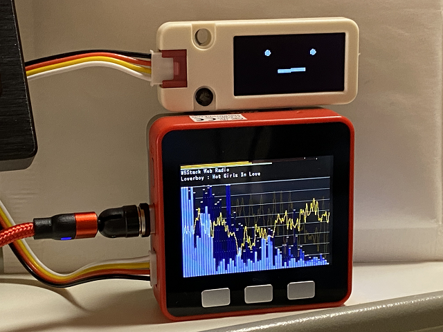

# M5Unified_avatar_WebRadio_LED
M5Unified_avatar_WebRadio_LED

  

OLED/LCD表示、LEDレベルメーター付きWebRadioファームです。 

WebRadioは、ESP8266Audio Libraryのexample"WebRadio"をベースにさせていただきました。 
FFTの表示は、M5Unifiedライブラリのexample"をベースにさせていただきました。 
Avatar表示は、meganetaaanさんのm5stack-avatarをベースにさせていただきました。 
オリジナルはこちら。 
An M5Stack library for rendering avatar faces <https://github.com/meganetaaan/m5stack-avator> 

---
### 注意：未対策の不具合が有ります ###
~~まだ動作が不安定です。時々画面が真っ黒になったり、リブートしたりします。~~   

### このプログラムを動かすのに必要な物 ###
* [M5Stack](http://www.m5stack.com/ "Title") (M5Stack FireとM5Stack Core2 for AWSで動作確認をしました。) 
* [OLEDディスプレイユニット](https://www.switch-science.com/catalog/7233/ "Title") または [ LCDディスプレイユニット](https://www.switch-science.com/catalog/7358/ "Title")
* Arduino IDE (バージョン 1.8.15で動作確認をしました。) 
* [M5Unified](https://github.com/m5stack/M5Unified/tree/develop/ "Title")ライブラリ((developバージョンで動作確認をしました。)) 
* [M5GFX](https://github.com/m5stack/M5GFX/tree/develop/ "Title")ライブラリ(バージョン 0.0.18で動作確認をしました。) 
* [ESP8266Audio](https://github.com/earlephilhower/ESP8266Audio/ "Title") 
* [FastLED](https://github.com/FastLED/FastLED/ "Title")ライブラリ 
  

### 注意 ###

* M5Stackボードマネージャーのバージョン2.0.0で動作確認をしました。バージョン2.0.2ではビルドエラーになります。

---
### WiFiの設定 ###
* "M5Unified_avatar_WebRadio_LED.ino"の95行目付近、SSIDとPASSWORDを設定してください。

### OLED/LCDのAvatar表示を使用しない場合 ###

* "M5Unified_avatar_WebRadio_LED.ino"の43行目をコメントにしてください。

### M5Stack-SD-Updaterに対応させる場合 ###

* [M5Stack-SD-Updater](https://github.com/tobozo/M5Stack-SD-Updater/ "Title")ライブラリが必要です。 
* "M5Unified_avatar_WebRadio_LED.ino"の24行目のコメントを外して"#define USE_SD_UPDATER"を有効にします。 

M5Stack-SD-Updaterの使い方はこちらを参照してください。：<https://github.com/tobozo/M5Stack-SD-Updater>

---

### ボタン操作方法 ###
* ボタンA：組み込み済みのラジオ局を切り替えます。 
* ボタンB：音量を小さくします。 
* ボタンC：音量を大きくします。 

### WebUI操作方法 ###
1. M5M5Stackの電源を入れるとWiFi APに接続し、APから割り当てられたIPアドレスが表示されます。
2. 表示されたIPアドレスにブラウザでアクセスすると操作パネルが表示されます。
  
  

---

### WebRadioの参考URL ###
<http://wbgo.streamguys.net/thejazzstream> 
<http://beatles.purestream.net/beatles.mp3> 
<http://listen.181fm.com/181-beatles_128k.mp3> 
<http://ice1.somafm.com/illstreet-128-mp3> 
<http://ice1.somafm.com/secretagent-128-mp3> 
<http://ice1.somafm.com/seventies-128-mp3> 
<http://ice1.somafm.com/bootliquor-128-mp3> 
<http://stream.srg-ssr.ch/m/rsj/mp3_128> 
<http://icecast.omroep.nl/3fm-sb-mp3>  

